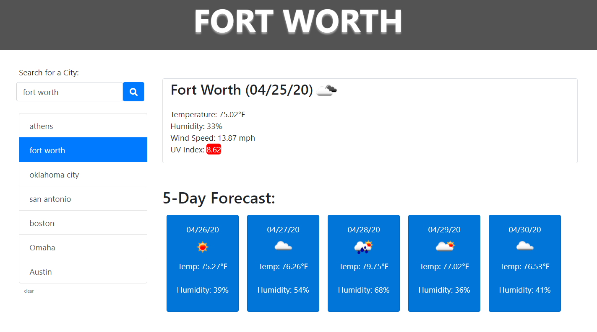

## Benji Francis

## Challenge 6 Server-Side APIs Challenge: Weather Dashboard

## Info

Created a dashboard that uses the [OpenWeather API](https://openweathermap.org/api) to retrieve weather data for cities that are searched for by user. Uses localStorage to store any cities that have been searched for prior and allows user to call them up quickly.
Once you have selected the city then you will be promted with the 5 day advance weather forcast in advance.
All the data for that specific day would be fetched from the API we are calling

## Git Link

https://github.com/mambu1998/Weather-DashBoard

## Live Link

https://mambu1998.github.io/Weather-DashBoard/

The following image demonstrates the application functionality:



## User Story

```
AS A traveler
I WANT to see the weather outlook for multiple cities
SO THAT I can plan a trip accordingly
```

## Acceptance Criteria

```
GIVEN a weather dashboard with form inputs
WHEN I search for a city
THEN I am presented with current and future conditions for that city and that city is added to the search history
WHEN I view current weather conditions for that city
THEN I am presented with the city name, the date, an icon representation of weather conditions, the temperature, the humidity, the wind speed, and the UV index
WHEN I view the UV index
THEN I am presented with a color that indicates whether the conditions are favorable, moderate, or severe
WHEN I view future weather conditions for that city
THEN I am presented with a 5-day forecast that displays the date, an icon representation of weather conditions, the temperature, and the humidity
WHEN I click on a city in the search history
THEN I am again presented with current and future conditions for that city
```
